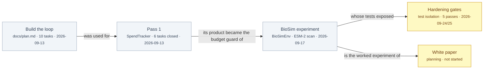

# §build

<!-- HACP L1 · local source; the Notion Section row mirrors this file. -->

**Tag:** `§build` · **Layer:** L1 · **Holds:** phases, branches, what is in flight · **Reaches:** `docs/plan.md` and the pass-1 history in version control

**TL;DR** — The loop was built in ten planned tasks on 2026-09-13, then used once: a single pass closed six tasks with none set aside. Two items are in flight — a test-isolation fix that has passed its gate and is waiting to be pushed, and a white paper that is being planned.

## Phases

*Yellow is in flight. Nothing in the white paper executes before its plan passes the human gate.*

## Pass 1, from version control

Every closed task is one commit on the branch, and the tree before each claim is a commit too ([`docs/drain-1-notes.md`](../drain-1-notes.md)).

| Task | Satisfies | Closed at | Commit |
|---|---|---|---|
| U-001 record and total | R1 | attempt 0 | `28af3c4` |
| U-002 load the ceiling | R2 | attempt 0 | `592ede7` |
| U-003 the exception carries its numbers | R3 | attempt 0 | `e8d6e28` |
| U-004 the check boundary | R3 | attempt 0 | `e27fd43` |
| U-005 persist and restore, crash-atomic | R4 | attempt 0 | `72af9a1` |
| U-006 expose as an aviary tool | R5 | attempt 0 | `2e00aa3` |

Skeleton commit `8f6a8e6` precedes U-001; all dated 2026-09-13. The worklist tool itself was built in 12 commits that day (`git log -- .claude/skills/v2r-loop/scripts/register.py`).

## In flight

| Item | State | Evidence |
|---|---|---|
| Test-isolation fix (deferred finding F08) | Gated and receipted; waiting on a push, then the coordinator's review and landing | [`docs/deferred-findings.md`](../deferred-findings.md) row F08; receipt `…-qgr-pr-prep-20260925-0558-64e74db.md` under `workstreams/aviary-biosim/qgr/` |
| White paper (the loop as a lab method, BioSim as the worked experiment) | Spec approved 2026-09-25; plan being written; no build before the human plan gate | the spec lives in the coordinating repo, not here; the paper will live under `paper/` |

## Read the source

- [`docs/plan.md`](../plan.md) — the ten-task implementation plan the loop was built from (2026-09-17)
- [`docs/drain-1-notes.md`](../drain-1-notes.md) — what pass 1 actually showed (2026-09-17)
- [`docs/deferred-findings.md`](../deferred-findings.md) — findings judged real and not yet fixed (2026-09-25)

Back to the [index](index.md).
