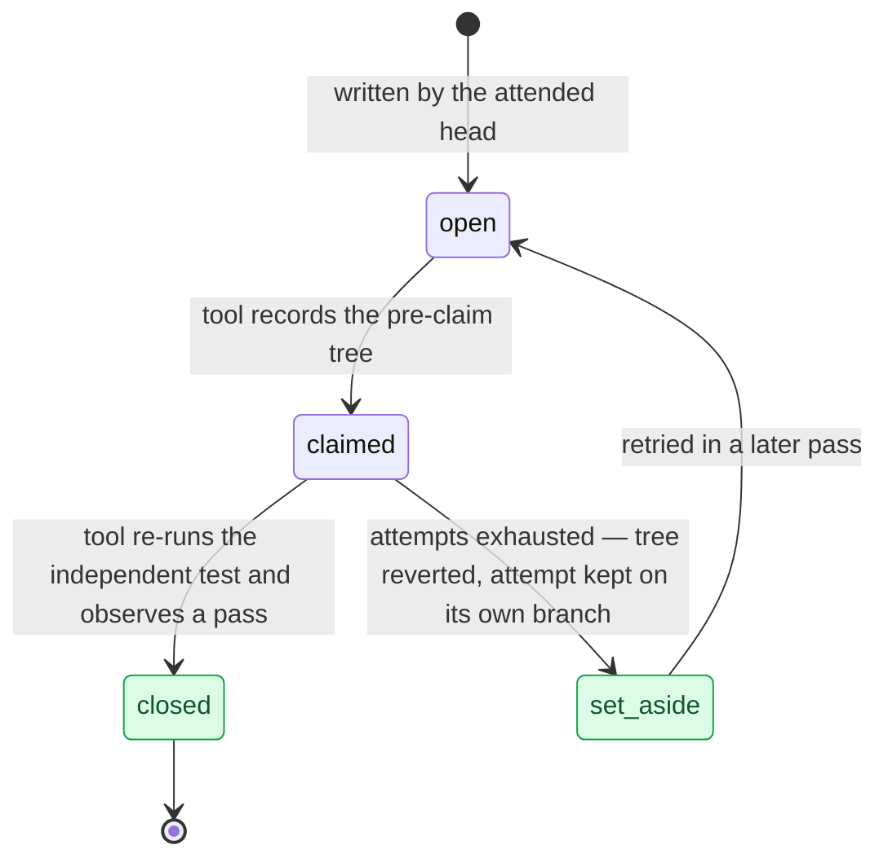

# §design

<!-- HACP L1 · local source; the Notion Section row mirrors this file. -->

**Tag:** `§design` · **Layer:** L1 · **Holds:** architecture, interfaces, and decisions with their declined alternatives · **Reaches:** `docs/spec.md` and the four decision records

**TL;DR** — One component is trusted and everything else is not: a 483-line worklist tool with no model inside owns every state change a task can make, and it is the only thing that may write that a task passed.

## The life of a task

*Only the worklist tool moves a task between states; a task never moves backwards inside a pass, and a task set aside leaves nothing in the working tree.*

## Components and what each may never do

| Component | Owns | Never |
|---|---|---|
| Worklist tool (`register.py`) | every state change; re-running independent tests; the ceilings; the pass record | judging whether work is good |
| Attended head | research, glossary, spec, plan, worklist, interface skeleton | running any task |
| Test author | the independent test, from the task statement plus the skeleton | seeing the implementation |
| Implementer | filling one stub | seeing the test; editing the test directory |
| Pass driver (the skill) | claiming, dispatching the two authors, sequencing | asserting a close |

Source: [`docs/spec.md`](../spec.md) § Components and boundaries.

## Decisions, with the alternative declined

| Record | Decided | Declined | Date |
|---|---|---|---|
| [ADR-0001](../adr/0001-register-cli-owns-every-transition.md) | The tool re-runs the independent test; the model cannot assert a close in prose | Letting the model own the worklist file | 2026-09-13 |
| [ADR-0002](../adr/0002-requirements-standing-build-units-derived.md) | Requirements stand; tasks derive from them and close once | One list serving both roles | 2026-09-13 |
| [ADR-0003](../adr/0003-instincts-pinned-per-drain.md) | Lessons are pinned for a pass, adopted between passes | Continuous learning mid-pass | 2026-09-13, **corrected 2026-09-17** |
| [ADR-0004](../adr/0004-park-reverts-the-tree-and-does-not-cascade.md) | A failed task reverts the tree and cascades to nothing | Keeping partial work; a dependency graph | 2026-09-13 |

## Where the build diverged from the design

| Divergence | Status | Where recorded |
|---|---|---|
| The spec asked for traced calls per step; the code published objects instead, which succeeded, printed a confident URL, and returned zero to the trace query | **Fixed** 2026-09-13 (commit `8e0d2b5`), verified by querying the trace back | [`docs/drain-1-notes.md`](../drain-1-notes.md) § Stage 4 cannot read stage 3's evidence |
| The lessons pin is a tree hash over a store that background hooks rewrite, so it moves when nothing was learned and can move mid-pass | **Open** — three candidate fixes ranked, none chosen | [ADR-0003](../adr/0003-instincts-pinned-per-drain.md) § Correction |
| The two per-task prompts are not pinned, and they are where the difficulty lives | **Claim narrowed** from reproduction to attribution | [`docs/CONTEXT.md`](../CONTEXT.md) § Flagged ambiguities |

## Read the source

- [`docs/spec.md`](../spec.md) — the approved design (design 2026-09-12; file updated 2026-09-17). Its header links to a glossary and decision folder at `docs/v2r-loop/…`, a path that does not exist in this repo; the files are [`docs/CONTEXT.md`](../CONTEXT.md) and [`docs/adr/`](../adr/).
- [`docs/CONTEXT.md`](../CONTEXT.md) — the glossary, including four terminology collisions resolved before they cost a pass (2026-09-17)
- [`docs/adr/`](../adr/) — the four decision records

Back to the [index](index.md).
