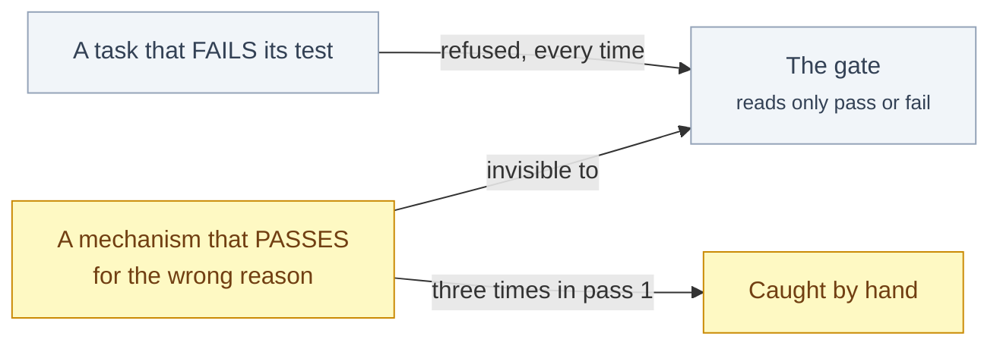

# §eval

<!-- HACP L1 · local source; the Notion Section row mirrors this file. -->

**Tag:** `§eval` · **Layer:** L1 · **Holds:** what proves it works — gates, receipts, independent suites, run records · **Reaches:** the test suites, the signed receipts, the pass-1 notes

**TL;DR** — Three kinds of evidence exist and they are not equal: numbers measured for the current receipt, numbers carried forward from an earlier run, and numbers reported by the science run. Every figure below says which it is.

## Evidence, by how much it can be trusted

| Claim | Value | Kind | Artifact |
|---|---|---|---|
| Worklist-tool suite green | 42 passed | **measured** 2026-09-25 | receipt `…-qgr-pr-prep-20260925-0558-the pr-prep receipt current at landing.md`, § Review Summary |
| Science suite green, with `torch` installed and in four collection orders | 265 passed | **measured** 2026-09-25 | same receipt |
| Deliberately broken copies of the guard all caught | 36 live killed + 1 retired | **measured** 2026-09-25 | same receipt |
| Independent component tests from pass 1 | 75 | **carried forward** — not re-run since pass 1 | [`SUBMISSION.md`](../../SUBMISSION.md) § Status, which says so |
| Pass 1 outcome | 6 closed, 0 set aside, every task at attempt 0 | **reconstructed** from version control | commits `28af3c4` … `2e00aa3`; [`docs/drain-1-notes.md`](../drain-1-notes.md) |
| Substitutions scored by the protein model | 2,090 | **reported** by the science run | [`SUBMISSION.md`](../../SUBMISSION.md) § Results |
| Six disulfide cysteines vs every other residue, mean score | −13.02 vs −5.85 | **reported** by the science run | same table |
| Measurements chosen by the discovery agent | 66 | **reported**; the artifact and its trace were located on 2026-09-26 (the #272 plan, Task 6 records where) | same table |
| Trace query after the emission fix | 0 → 19 | **reported** | [`SUBMISSION.md`](../../SUBMISSION.md) § Sponsor tools |

The receipt's *Hash E* (the pr-prep receipt current at landing) is the digest of the diff it attests to; a receipt whose diff has moved refuses to verify, which is how the earlier `cedae49` receipt was retired.

## What the gate can and cannot see

*The gate is very good at the left edge and blind to the right one; the three pass-1 findings and the five hardening passes that followed are all of the right-hand shape.*

## Read the source

- `workstreams/aviary-biosim/qgr/` — signed receipts; the current one is dated 2026-09-25, an earlier one is filed under `landed/`, one is marked superseded
- [`docs/drain-1-notes.md`](../drain-1-notes.md) — pass 1 as it actually ran (2026-09-17)
- [`SUBMISSION.md`](../../SUBMISSION.md) § Results and § Run it — the science figures and the commands that reproduce the suites (2026-09-25)

Back to the [index](index.md).
