# Aviary-BioSim — Index

<!-- HACP L0 · local source. The Notion Index row (CTO-written) mirrors this file;
     edit here, never there. Links are relative; no workspace URLs or page ids. -->

| | |
|---|---|
| **Project** | `Aviary-BioSim` — a build loop whose worker cannot grade its own work, and a protein-model experiment built under it |
| **This page** | L0 — the project index. One screen. |
| **Alignment** | What was built matches [`docs/spec.md`](../spec.md) (design approved 2026-09-12) and [`docs/plan.md`](../plan.md) tasks 1–10. Three divergences are recorded, not hidden: trace emission drifted from the spec and was fixed; the lessons pin does not enforce what its decision intended ([ADR-0003](../adr/0003-instincts-pinned-per-drain.md), unfixed); the replay claim was narrowed from reproduction to attribution ([`docs/CONTEXT.md`](../CONTEXT.md)). Detail in [§design](design.md). |
| **Protocol** | HACP — the framework's documentation protocol (`REFERENCE-HACP.md`, shipped with the aiadlc plugin, not in this repo) |
| **Public** | Yes. Nothing on these pages names a sequence identifier or a secret. |

## Index

| Tag | State | Count |
|---|---|---|
| [`§vision`](vision.md) | current | 2 documents |
| [`§design`](design.md) | current, 1 correction recorded | 1 spec + 4 decision records |
| [`§build`](build.md) | pass 1 complete; 2 items in flight | 1 plan, 10 tasks built, 6 tasks closed by the loop |
| [`§eval`](eval.md) | last gate green (2026-09-25) | 1 current receipt, 1 landed, 1 superseded |
| [`§risk`](risk.md) | 6 known gaps | 6 |
| [`§decision`](decision.md) | 4 open | 4 |

**TL;DR** — A build loop in which the agent that writes the code cannot record that it passed: an independent test, re-run by a small tool with no model inside it, is the only thing that can close a task. One pass has run (6 tasks closed, none set aside), and its main finding — a mechanism can report success while the property it guarantees is absent — is now the spine of a white paper in progress.

## Where it sits

```mermaid
flowchart LR
  classDef quiet fill:#f1f5f9,stroke:#94a3b8,color:#334155
  classDef trust fill:#dcfce7,stroke:#16a34a,color:#14532d
  H["Human<br/><small>one vision · one approval</small>"]:::quiet
  HEAD["Attended head<br/><small>research · interview · spec · plan</small>"]:::quiet
  WL["Worklist<br/><small>.v2r/register.yaml</small>"]:::trust
  TA["Test author<br/><small>sees the task statement only</small>"]:::trust
  IMP["Implementer<br/><small>never sees the test</small>"]:::trust
  GATE["Worklist tool<br/><small>register.py · no model inside</small>"]:::trust
  BR["Green branch<br/><small>one commit per closed task</small>"]:::quiet
  TR["Traces<br/><small>Weave</small>"]:::quiet
  INS["Lessons store<br/><small>.aiadlc/instincts</small>"]:::quiet
  PROD["What it built<br/><small>SpendTracker → BioSimEnv → ESM-2 experiment</small>"]:::quiet
  H -->|"states a vision"| HEAD
  HEAD -->|"writes tasks into"| WL
  WL -->|"hands one task to"| TA
  WL -->|"hands the same task to"| IMP
  TA -->|"writes an independent test for"| GATE
  IMP -->|"submits code to"| GATE
  GATE -->|"re-runs the test · closes or sets aside"| BR
  GATE -->|"emits a span per step"| TR
  TR -->|"read between passes"| INS
  INS -->|"pinned for a pass"| GATE
  BR -->|"is"| PROD
```

*Green is the trust boundary: nothing inside it is recorded by the agent doing the work, and only the worklist tool can write that a task passed.*

## Decisions taken

| Decision | Chosen | Alternatives considered | Why this one | Impact | Date |
|---|---|---|---|---|---|
| Who may close a task | A small tool with no model inside re-runs the independent test itself | The model reads and writes the worklist file directly (simpler, no CLI) | A worklist kept by an interested party drifts optimistic in exactly the unattended conditions nobody is checking | One component is trusted by everything downstream; its tests are adversarial — [ADR-0001](../adr/0001-register-cli-owns-every-transition.md) | 2026-09-13 |
| Requirements vs tasks | Requirements stand for the life of the project; tasks derive from them and close exactly once | One numbered list serving both roles | Closing a requirement stops enforcing it; standing tasks never let the loop finish | A regression opens a new task under the same requirement — [ADR-0002](../adr/0002-requirements-standing-build-units-derived.md) | 2026-09-13 |
| When lessons are adopted | Pinned for the length of a pass; adopted only between passes | Continuous learning mid-pass | The same worklist replayed must be attributable to its declared inputs | One pass of latency per lesson; the pin is only an approximate label — corrected 2026-09-17 — [ADR-0003](../adr/0003-instincts-pinned-per-drain.md) | 2026-09-13 |
| What a failed task leaves behind | The tree is reverted; the attempt is kept on its own branch; nothing cascades | Keep partial work; a dependency graph that sets dependants aside automatically | Every commit on the branch is green by construction; cascade machinery was priced and declined until the cost is measured | A foundational failure may cost each dependant its full attempt budget — [ADR-0004](../adr/0004-park-reverts-the-tree-and-does-not-cascade.md) | 2026-09-13 |
| The environment's reward signal | Wired to 0.0 | A scalar derived from the model's scores | This is tool-mediated discovery, not reinforcement learning; an invented scalar is a fabricated signal | Recorded in [`SUBMISSION.md`](../../SUBMISSION.md) § How it's built, not in a decision record | 2026-09-17 |

## Decisions needed

- **The lessons pin** *(raised 2026-09-17)* — it moves when nothing was learned. Three candidate fixes are ranked in [ADR-0003](../adr/0003-instincts-pinned-per-drain.md); none is chosen. See [§decision](decision.md).
- **A second pass** *(raised 2026-09-17)* — the first pass that would run with a non-empty lessons pin, and the first that could drift. Run it, and under what precondition?
- **A token price** *(raised 2026-09-17)* — the discovery loop refuses to start without one, so budget enforcement has never run end to end ([`SUBMISSION.md`](../../SUBMISSION.md) § Status).
- **A capability with no caller** *(raised 2026-09-17)* — `as_tool` (requirement R5 in [`docs/demo-spec.md`](../demo-spec.md)) remains after the agent-facing record tool was removed. Keep or remove?

## Sections

| Tag | Holds | State | Updated |
|---|---|---|---|
| [`§vision`](vision.md) | what is attempted and why now → README problem statement, proving-run spec | current | 2026-09-26 |
| [`§design`](design.md) | architecture and declined alternatives → `docs/spec.md`, four ADRs | current, 1 correction | 2026-09-26 |
| [`§build`](build.md) | phases, branches, in flight → `docs/plan.md`, pass-1 history | 2 in flight | 2026-09-26 |
| [`§eval`](eval.md) | what proves it works → suites, receipts, pass-1 notes | green | 2026-09-26 |
| [`§risk`](risk.md) | what is unverified → known gaps | 6 open | 2026-09-26 |
| [`§decision`](decision.md) | what the principal owns | 4 open | 2026-09-26 |
