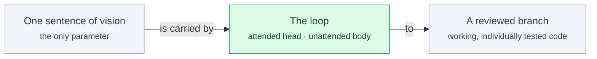

# §vision

<!-- HACP L1 · local source; the Notion Section row mirrors this file. -->

**Tag:** `§vision` · **Layer:** L1 · **Holds:** what is being attempted and why now · **Reaches:** the README problem statement and the proving-run spec

**TL;DR** — Most agent loops grade their own homework. This one is built so the agent doing the work is structurally unable to record that the work passed, and its first real target is a drug-discovery environment for [aviary](https://github.com/Future-House/aviary), which has no public example of a chemistry or assay environment.

## What is attempted

*The loop takes exactly one argument and no flags; everything else is derived or declared at a single approval.*

| The problem | The answer |
|---|---|
| When an agent writes the code, runs the check and reports success, a weak or silently broken check is never noticed, and the loop confidently improves at passing a test nobody enforced. | The implementer never sees the test it must satisfy; the test author never sees the implementation; a small tool with no model in it re-runs the test and refuses to close a task on anything less than an observed pass. |

## Why now

The repository's own history is the argument. An independent review found that the worklist tool's test step had never executed a single assertion — its exit code was misread as *test failed* — while the tool's own suite stayed green throughout. The check was rebuilt to read the test runner's report rather than its exit code ([`README.md`](../../README.md) § The problem with self-improving loops).

## The proving run

The first thing built under the loop was a spend meter, `SpendTracker` — five standing requirements (R1–R5) chosen to be small enough to finish in one pass and hard enough to be worth gating ([`docs/demo-spec.md`](../demo-spec.md)). That meter then became the budget guard of `BioSimEnv`, an aviary environment whose tools run a protein language model over real sequences ([`SUBMISSION.md`](../../SUBMISSION.md) § Summary).

## Read the source

- [`README.md`](../../README.md) — the problem statement and how the loop runs (updated 2026-09-17)
- [`docs/demo-spec.md`](../demo-spec.md) — the proving-run requirements (2026-09-13)
- [`SUBMISSION.md`](../../SUBMISSION.md) — the submission summary, with every number labelled by the run it came from (2026-09-25)

Back to the [index](index.md).
